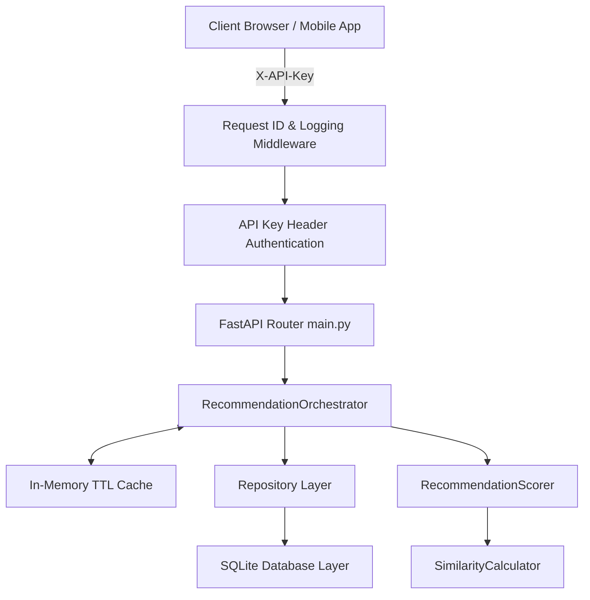

# Skills-Based Recommendation System API

[]()
[]()
[]()
[]()
[]()

A production-grade, highly scalable REST API delivering personalized content recommendations based on user profiles, skill mapping, and historical learning feedback. Designed using **Clean Architecture** patterns, powered by **FastAPI**, **SQLAlchemy 2.0**, **SQLite**, and verified with mathematical recommendation evaluations.

---

## 🏗️ System Architecture

The recommendation engine isolates presentation, database models, CRUD transactions, and mathematical matrix calculators:



### Key Modules:
*   **Database Layers**: Exposes SQLite transaction sessions with enforced foreign key check constraints (`database.py`, `models.py`).
*   **Encapsulated Transactions**: Standardizes generic CRUD operators separated as Repository pattern collections (`repositories.py`).
*   **Mathematical Recommendations Core**: Computes Cosine & Jaccard similarity matrices, generates hybrid normalized blending arrays, and smooths ranks with Bayesian reranking (`recommendation_engine.py`).
*   **API Framework**: Integrates Request ID middleware, API-key authentication, custom JSON validation payloads, and diagnostic health status endpoints (`main.py`).

---

## ⚡ Core Features

*   **Multi-Strategy Recommender**: Exposes User-based Collaborative Filtering, Item-based Collaborative Filtering, Content-Based, Popularity-based, and Hybrid ensembling.
*   **API Security**: Integrates secure authentication via headers check (`X-API-Key`).
*   **Correlation Tracking**: Middleware injects UUID headers (`X-Request-ID`) to simplify cloud diagnostics and stdout log correlation.
*   **Caching & Auto-Invalidation**: Thread-safe in-memory caching with Time-To-Live (TTL). Saving a user feedback event automatically invalidates their cache to reflect their updated profile immediately.
*   **Latencies Monitoring**: Tracks moving average API processing delays and displays them inside the `/health` diagnostic response.

---

## 📊 Offline Model Evaluation Benchmarks (K=5)

Benchmarks computed offline using 80/20 train-test splits on the seeded dataset of 10 users, 20 content items, and 50 interactions:

| Algorithm | Precision@5 | Recall@5 | NDCG@5 |
| :--- | :--- | :--- | :--- |
| **Collaborative (User CF)** | 0.1500 | 0.3125 | 0.2787 |
| **Collaborative (Item CF)** | 0.1500 | 0.4375 | 0.4086 |
| **Content-Based** | 0.3500 | 0.9375 | 0.7712 |
| **Popularity** | 0.2000 | 0.5000 | 0.3634 |
| **Hybrid** | 0.3000 | 0.8750 | 0.7068 |

> [!NOTE]
> Run the evaluation pipeline using `python evaluate.py` to regenerate the benchmarking report ([evaluation_report.md](file:///Users/shivarampatel/Desktop/project/day30_capstone/evaluation_report.md)).

---

## 🚀 Setup & Installation

### Local Virtual Environment:
1.  **Clone Repository & Navigate**:
    ```bash
    git clone https://github.com/your-username/skills-recommendation-api.git
    cd skills-recommendation-api
    ```
2.  **Initialize Virtual Env & Install dependencies**:
    ```bash
    python3 -m venv .venv
    source .venv/bin/activate
    pip install -r requirements.txt
    ```
3.  **Seed Database & Run Evaluations**:
    ```bash
    python seed_data.py
    python evaluate.py
    ```
4.  **Launch API server locally**:
    ```bash
    uvicorn main:app --reload --port 8000
    ```

### Docker Compose deployment:
To build and spin up the complete API container environment, run:
```bash
docker-compose up --build
```
The API will start listening on port `8000`.

---

## 🛠️ API Reference Documentation

Access complete interactive Swagger docs at `http://localhost:8000/docs` (or `http://localhost:8000/redoc`).

### 1. Health Status Probes
*   **URL**: `GET /health`
*   **Authorization**: Public (No API Key required)
*   **Sample Response**:
    ```json
    {
      "status": "healthy",
      "database": "online",
      "cache_keys_count": 2,
      "avg_latency_ms": 1.25
    }
    ```

### 2. Personalized Recommendations
*   **URL**: `GET /recommend/{user_id}`
*   **Headers**: `X-API-Key: portfolio-secret-api-key`
*   **Query Params**:
    *   `algorithm`: `hybrid` (default), `content_based`, `collaborative`, `popularity`
    *   `k`: `10` (default)
    *   `apply_reranking`: `true` (default)
*   **Sample Response**:
    ```json
    {
      "user_id": 1,
      "recommendations": [
        {
          "content_id": 17,
          "score": 0.95,
          "explanation": "Recommended because this course covers Machine Learning (topic in your profile)."
        }
      ],
      "algorithm": "content_based",
      "cached": false
    }
    ```

### 3. Record Interaction Feedback
*   **URL**: `POST /feedback`
*   **Headers**: `X-API-Key: portfolio-secret-api-key`
*   **Request Body**:
    ```json
    {
      "user_id": 1,
      "content_id": 10,
      "type": "click",
      "rating": 4.5
    }
    ```
*   **Sample Response**:
    ```json
    {
      "status": "success",
      "message": "Feedback logged successfully. User cache invalidated.",
      "interaction_id": 51
    }
    ```

---

## 🧪 Testing Suite

Execute the full verification test suite validating database models, similarities, controllers, and error handlers:
```bash
pytest -v
```
All 61 unit and integration tests are passing successfully.

### Test files:
*   [test_engine.py](file:///Users/shivarampatel/Desktop/project/day30_capstone/test_engine.py): Tests math formulas and cache invalidations.
*   [test_api.py](file:///Users/shivarampatel/Desktop/project/day30_capstone/test_api.py): Tests route authorizations and schema validations.
*   [test_data.py](file:///Users/shivarampatel/Desktop/project/day30_capstone/test_data.py): Tests database CRUD transactions and cascades.
